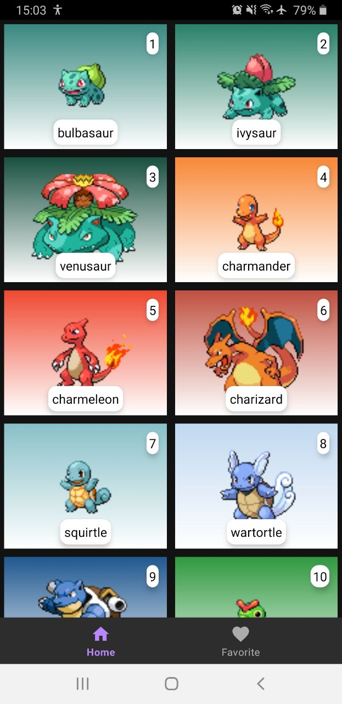
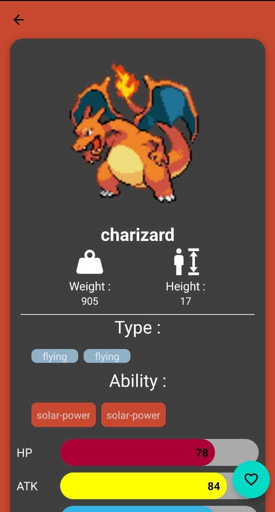
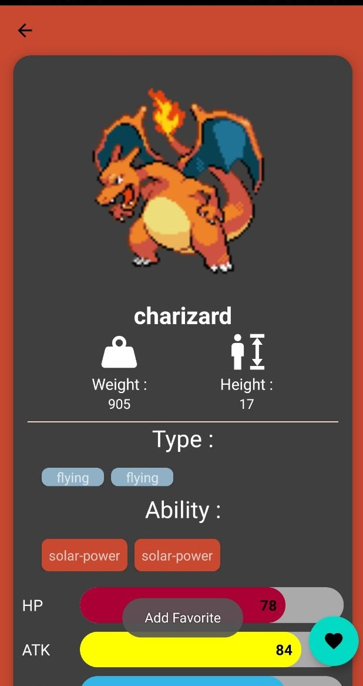
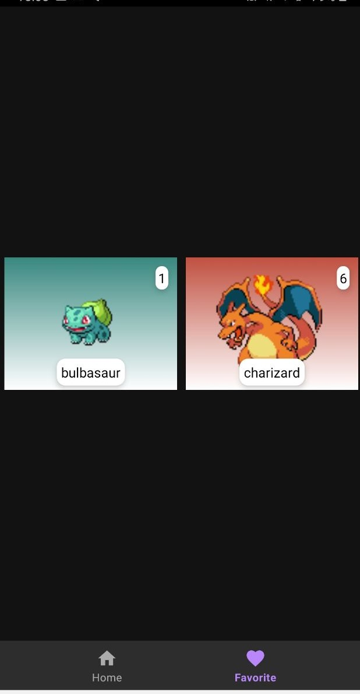

# Challenge juara android season 3
The project is a pokemon listing app that you can see the profile and the status of the pokemons.
This is the native android application that I created

## Technologies
- The project using **MVVM** architecture,
- **Jetpack Navigation** and Bottom Navigation for navigating,
- **Glide** for image processing,
- **Palette** to get dominant color
- **Retrofit** for Network calls,
- **Kotlin Coroutines**,
- **Live Data**,
- **Flow**,
- **Paging**
- **Dagger Hilt** for Dependency Injection
- **Room** Database for local storage,

## References
- API from PokeApi (https://pokeapi.co/)

## Screenshot
<table style="width:100%">
  <tr>
    <th></th>
    <th></th>
    <th></th>
    <th></th>
    <th></th>
  </tr>

</table>